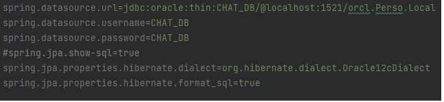
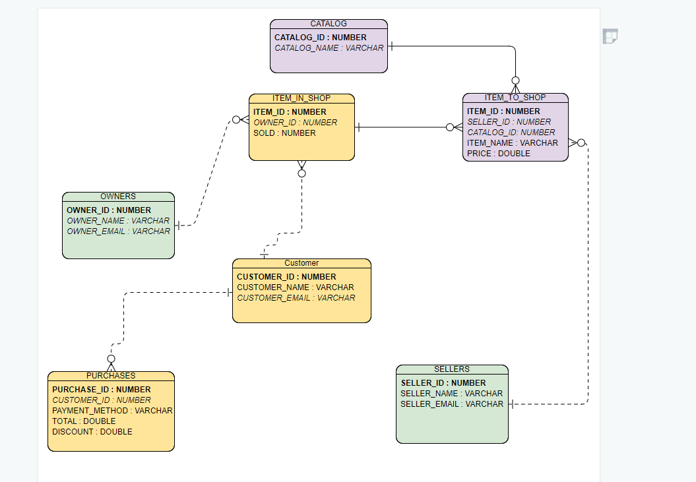
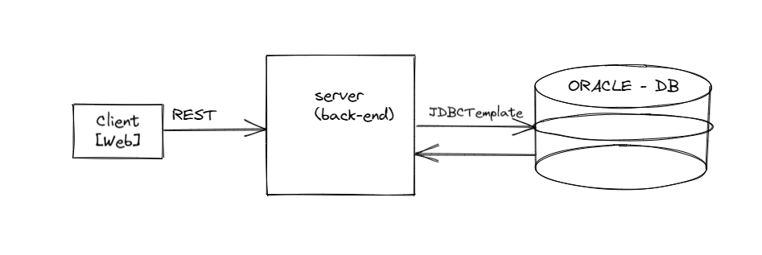
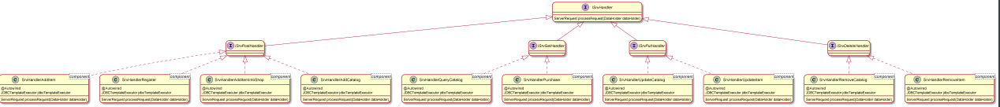
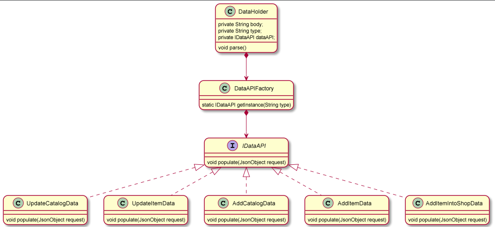
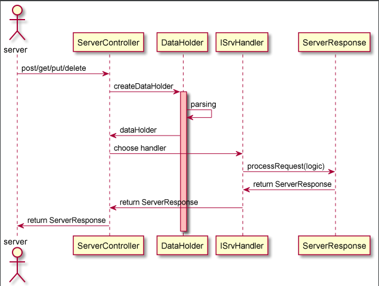
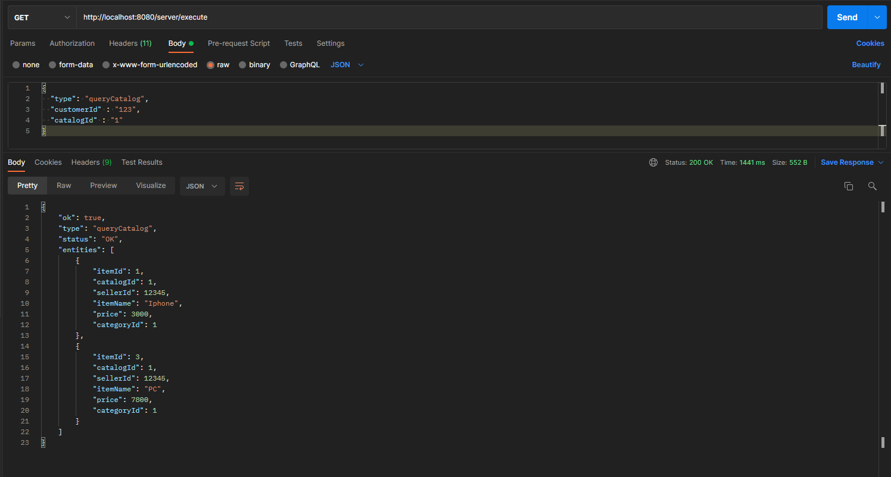
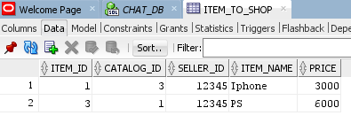

## Introduction

This Spring Boot application exposes a REST interface through which design and implement an online "Store" that should enable multiple sellers to set up shops that buyers can purchase

## Build Instructions

This project requires Maven 3.8.1 and JDK 8 to build. Run the following:

go to the project path (where the pom.xml exist) 

`> mvn clean compile`


## Run Instructions

In order to get the online store service running simply do:

1.`need to put the configuration of the oracle database under resources/db-config.properties directory`
for example:




2.`> mvn spring-boot:run` or `import from existing source in the intellij and configure the project`

That's it, the online store is now running at `http://localhost:8080`.

## Usage Instructions

need to create this relation database in sqlplus or sqldeveloper

ERD diagram for the tables




adding initial .yml file in resources to deploy to kubernetes in the future.


## API's

see how to use the api's from the docs directory

examples : 

Registration API

Sample request to register:
 
```
{
  "type": "registerCustomer"
  "id" : "123",
  "name" : "Omar",
  "email" : "omar.taiseerr@gmail.com"
}
http://localhost:8080/server/execute
```


## High-Level Architecture
```
in the furure I will add cache DB, Rate Limiter, reading about kafka and will add it.
```



## Low-Level Architecture
```
all of the diagrams under docs/diagrams
```
the important diagrams



here is the dataholder design



sequence diagrams




## Response & Persistent in DB
example for queryCatalog result




example for persistent data in DB





## Author: 

Omar Mahamid
